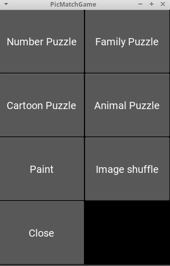
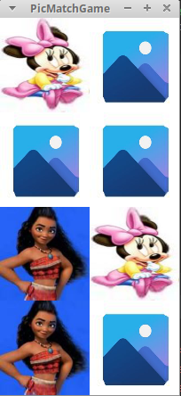
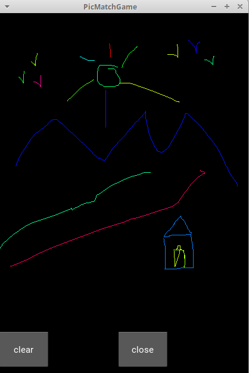
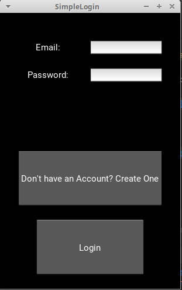
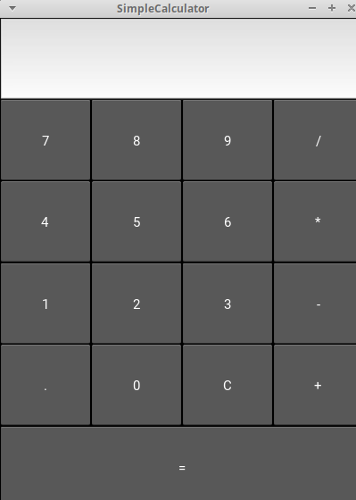

#main_picpuzzle.py
Tile game for kids created on python kivy

Requirements:
Python 3.7 or up

Sample screenprints:

Home screen

Cartoon puzzle game screen

Paint game screen

SimpleLoginApp.py

Login test app

main.py - Calculator app

